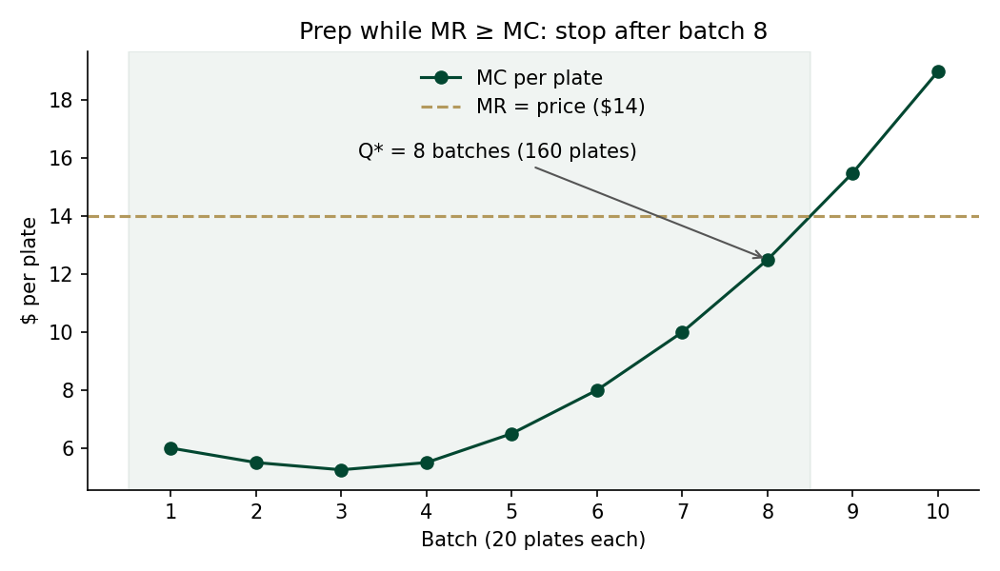

# Decision: Prep 160 lunch plates a day (8 batches)

*Written 2026-10-09, AFTER the analysis. Brief: [2026-10-02](../briefs/2026-10-02-lunch-plate-volume.md).*

## Recommendation

**Prep 8 batches (160 plates).** Daily profit peaks at **$755**. The 9th batch costs $15.50 a plate
to make and sells for $14, so it loses $30.

## Why

| Batch | Plates (cumulative) | MC per plate | MR (price) | Signal |
|-------|---------------------|--------------|------------|--------|
| 7 | 140 | $10.00 | $14.00 | Produce |
| **8** | **160** | **$12.50** | **$14.00** | **Produce (last one)** |
| 9 | 180 | $15.50 | $14.00 | Stop |

Full findings: [analysis/findings.md](../../analysis/findings.md).

## Hypothesis check

The brief guessed 120 plates. That was too low: overtime raises the cost per batch, but plates
still clear the $14 price until batch 9.

## Triggers to revisit

- **Price rises above $15.50** → add a 9th batch.
- **Unsold plates at close** → the model assumes everything sells; add a demand cap.

## AI use

The model was drafted with Claude Code from the spec and checked by hand. The counter-argument in
"Triggers" came from an AI stress-test. See [prompt-log.md](../../prompt-log.md).
